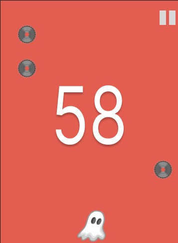

# A Very Slight Chance of Sawblades
## CS110 Final Project  1st Semester, 2024

## Team Members

#Nathan Bittar

***

## Project Description

In this project I made tried to recreate a mobile game called a Slight Chance of Sawblades.

***    

## GUI Design
a score on the back with a you character and sawblades falling from the top of the screen
### Initial Design

### Final Design

## Program Design

### Features

1. << Main Menu >>
2. << walking and jumping >>
3. << Sawblades spawning in and bouncing off walls >>
4. << jumping over Sawblade kills it >>
5. << Get a point for each sawblade killed >>
6. << Screbord in the background >>
5. << Game Over Screen >>

### Classes
- Controller : Contains main loop and and initiates pygame
- Character : Character that you play as. This class is responsible for drawing the character and giving it the ability to move and jump depending on whether the dedicated key that was clicked
- Sawblade : Responsible for spawning in sawblades at random x value from the cieling and making them fall and bounce off of walls
- Scoreboard : Responsible for the drawing and updating the scoreboard seen in the background

## ATP

| Step                 |Procedure             |Expected Results                   |
|----------------------|:--------------------:|----------------------------------:|
|  1:Walking           | click left and right | display changes to count = 1      |
|                      |     arrow keys not   |                                   |
|                      |simultaneously ofco   |                                   |
|----------------------|----------------------|-----------------------------------|
|  2:jumping           | Press the space bar  | The character should go up and    |
|                      |                      | down and be able to strafe either |
|                      |                      | direction while in midair         |
|----------------------|----------------------|-----------------------------------|
|  3: Scoreboard       | Start Game. Jump over| The screen should display a score |
|                      | sawblades and verify | on the center of the background.  |
|                      | that the score is    | When jumping over the sawblades   |
|                      | shown on the center  | the score should increase by 1.   |
|                      | of the screen. Jump  | When game restarts the score      |
|                      | over sawblades and   | is expected to reset              |
|                      | verify that the score|                                   |
|                      | is increasing.       |                                   |
|                      | restart game and make|                                   |
|                      | sure that it gets    |                                   |
|                      | reset back to 0.     |                                   |
|----------------------|----------------------|-----------------------------------|